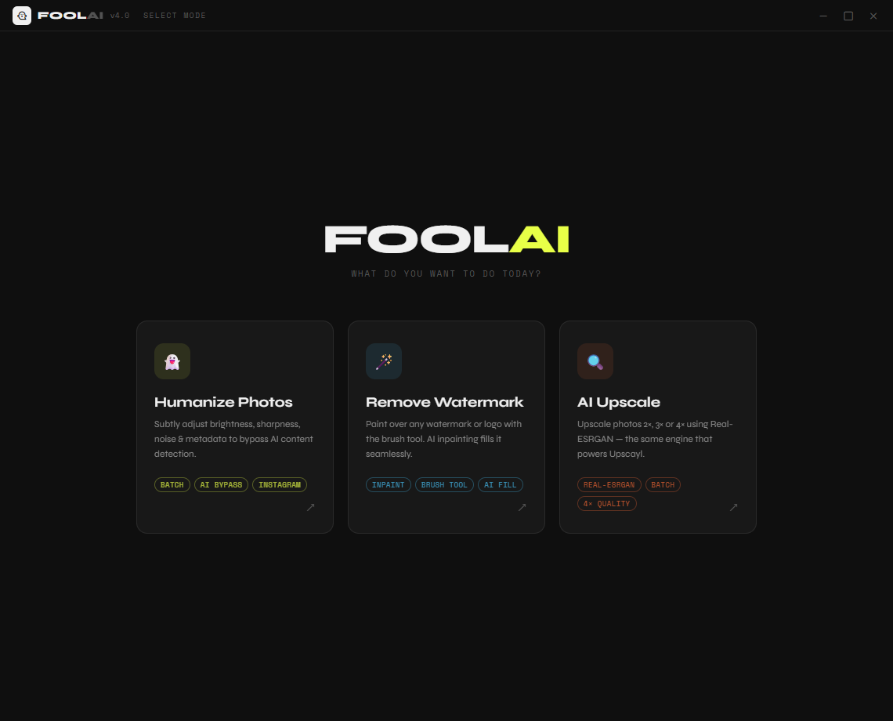
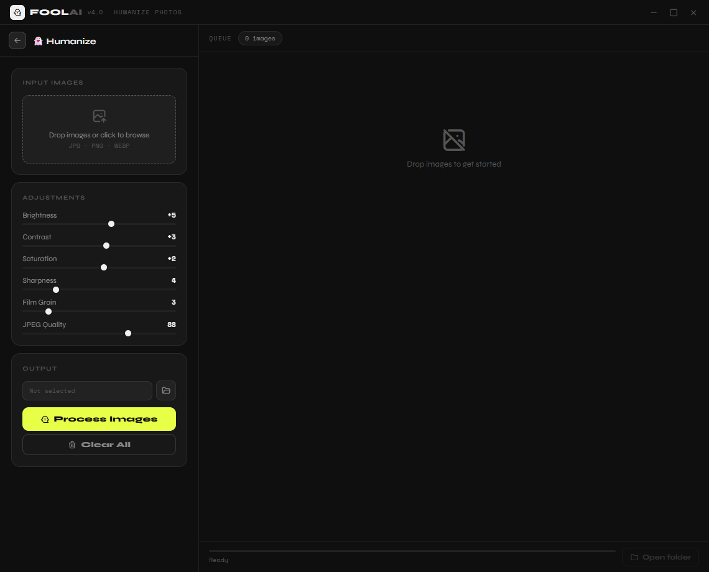
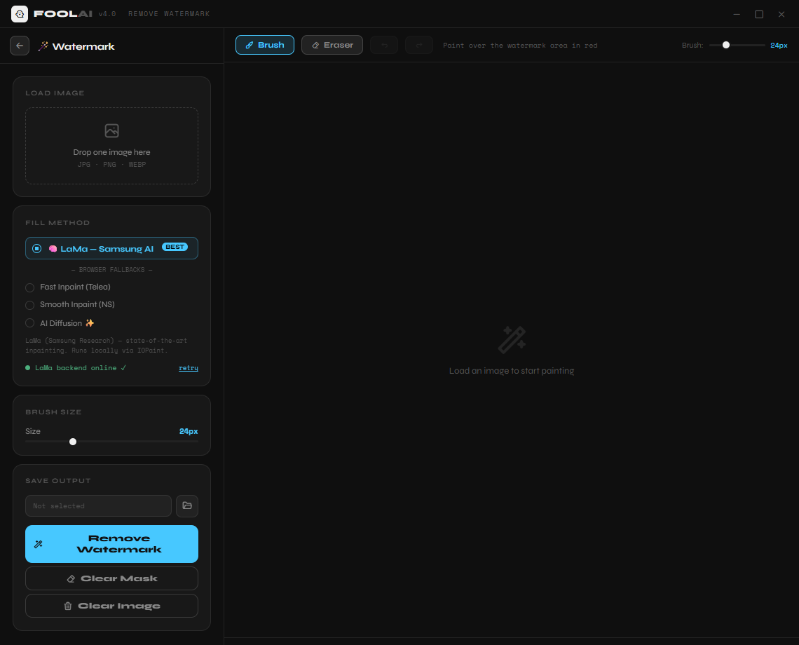
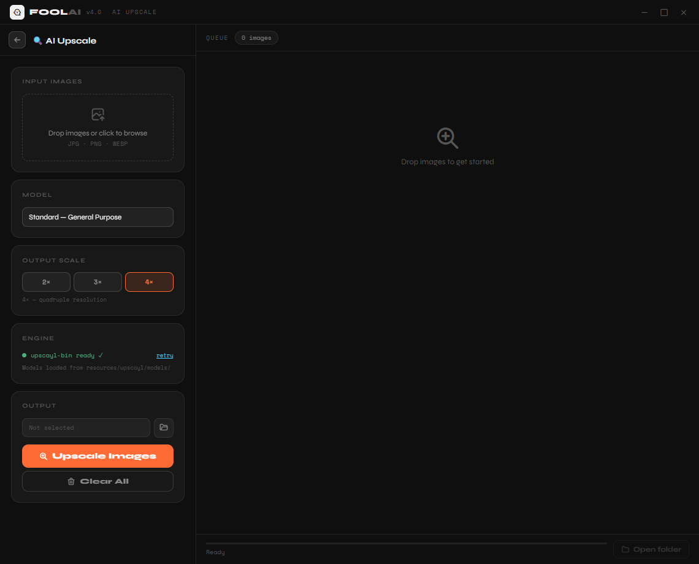

# FoolAI

A desktop app for AI-powered image processing. Three tools in one dark, minimal interface — built with Electron and Python.

---

## Screenshots

| | |
|---|---|
|  |  |
|  |  |

---

## Features

### 👻 Humanize Photos
Subtly transforms images to bypass AI-generated content detection (Instagram's badge system and similar detectors). Applies micro-adjustments to brightness, contrast, saturation, sharpness, and film grain — each image comes out slightly different so it reads as human-shot.

- Batch processing — drop as many images as you want
- Six independently adjustable sliders
- Before/after preview with side-by-side and comparison slider modes
- Saves to a folder of your choice

### 🪄 Remove Watermark
Paint over any watermark, logo, or text with a brush, and AI fills it in seamlessly using the LaMa inpainting model (Samsung Research).

- Brush + eraser tools with adjustable size
- **Undo/Redo** — Ctrl+Z / Ctrl+Y, up to 30 steps, including undoing processed results
- Iterative workflow — each removal operates on the latest result, not the original
- Four fill methods: LaMa (AI, best quality), Telea, Navier-Stokes, Diffusion (browser-based fallbacks)
- LaMa runs locally via [IOPaint](https://github.com/Sanster/IOPaint) — no data leaves your machine

### 🔍 AI Upscale
Upscale photos 2×, 3×, or 4× using Real-ESRGAN — the same neural engine and binary that powers [Upscayl](https://github.com/upscayl/upscayl).

- Seven models: Standard, Lite, High Fidelity, Remacri, Ultramix Balanced, Ultrasharp, Digital Art
- Batch processing
- Before/after comparison preview on completed images
- Runs fully offline

---

## Requirements

| Tool | Version | Purpose |
|------|---------|---------|
| [Node.js](https://nodejs.org) | 18+ | Electron runtime |
| [Python](https://python.org) | 3.9+ | IOPaint/LaMa backend (watermark removal) |
| Upscayl portable | Latest | `upscayl-bin.exe` + model files (upscale mode only) |

---

## Setup

### 1. Clone and install Node dependencies

```bash
git clone https://github.com/YOUR_USERNAME/FoolAI.git
cd FoolAI
npm install
```

### 2. Python backend — Watermark Removal

The LaMa backend runs as a local server alongside the app. In dev mode it auto-installs on first launch. To install manually:

```bash
pip install iopaint
```

> On first launch IOPaint downloads the LaMa model weights (~200 MB). This is a one-time download cached locally.

### 3. Upscayl binary — AI Upscale

The upscale mode uses Upscayl's `upscayl-bin.exe` and NCNN model files. These are not included in the repo due to file size — you copy them from an Upscayl portable release.

**Steps:**

1. Download the [Upscayl Windows portable release](https://github.com/upscayl/upscayl/releases/latest) — look for `Upscayl-x.x.x-win-portable.zip`
2. Extract it, then copy into your FoolAI folder:

```
Binary (3 files):
  <upscayl>/resources/bin/upscayl-bin.exe  →  resources/upscayl/bin/upscayl-bin.exe
  <upscayl>/resources/bin/vcomp140.dll     →  resources/upscayl/bin/vcomp140.dll
  <upscayl>/resources/bin/vcomp140d.dll    →  resources/upscayl/bin/vcomp140d.dll

Models (14 files — all .bin and .param pairs):
  <upscayl>/resources/models/*             →  resources/upscayl/models/
```

The status dot in the Upscale sidebar turns green once the binary is detected.

> Full instructions in `resources/upscayl/SETUP.md`.

---

## Running in dev mode

```bash
npm start
```

The app opens immediately. The LaMa backend starts in the background — allow 10–60 seconds on first run while it downloads model weights. The status dot in the Watermark sidebar shows when it's ready.

---

## Building a portable .exe

Building produces a single portable Windows executable that bundles the app, Python backend, and Upscayl binary together — end users just double-click, no install needed.

**Step 1 — Compile the Python backend**

```bash
pip install pyinstaller iopaint
npm run build:backend
```

This bundles Python + IOPaint into `backend_dist/foolai_backend.exe` via PyInstaller.

**Step 2 — Package the Electron app**

```bash
npm run build:win
```

Output lands in `dist/`. Before building, make sure `resources/upscayl/bin/` and `resources/upscayl/models/` are populated — otherwise the upscale feature won't work in the packaged app.

---

## GPU acceleration (optional)

By default LaMa runs on CPU. To use an NVIDIA GPU, edit `backend/server.py` and change:

```python
'--device', 'cpu',
```
to:
```python
'--device', 'cuda',
```

Then rebuild the backend. Requires CUDA-compatible NVIDIA GPU.

---

## Project structure

```
FoolAI/
├── main.js              # Electron main process — window, IPC, backend & upscayl spawning
├── preload.js           # Context bridge — exposes IPC API to the renderer
├── index.html           # Entire UI — all three modes, CSS, and JavaScript
├── backend/
│   └── server.py        # Python entry — launches IOPaint/LaMa on port 8080
├── assets/
│   └── icon.png
└── resources/
    └── upscayl/
        ├── bin/         # upscayl-bin.exe + DLLs  (not in repo — copy from Upscayl)
        ├── models/      # .bin + .param model files (not in repo — copy from Upscayl)
        └── SETUP.md     # Step-by-step instructions for populating these folders
```

---

## Tech stack

| Layer | Technology |
|-------|-----------|
| Desktop shell | Electron 36 |
| UI | Vanilla JS + CSS, Syne + Space Mono fonts, Tabler Icons |
| Watermark AI | [IOPaint](https://github.com/Sanster/IOPaint) — LaMa model by Samsung Research |
| Upscale AI | [Upscayl](https://github.com/upscayl/upscayl) binary — Real-ESRGAN NCNN |
| Packaging | electron-builder (portable Windows exe) |
| Python bundling | PyInstaller |

---

## License

MIT
